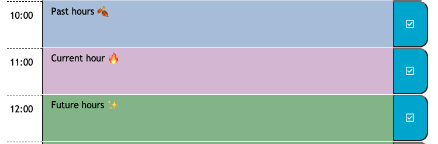

# Work Day Scheduler (Bootcamp Assignment 5 -  Third Party APIs)

By: Sadie Sial


## User Story

```
AS AN employee with a busy schedule
YOU WANT to add important events to a daily planner
SO THAT you can manage my time effectively
```

```
In this application the user is presented with a working hours scheduler. The user will be able to see the current date and time along the the top portion of the screen. Below, there is a simple scheduler that allows for the user to preview their day from 06:00 to 17:00 (6am - 5pm for those outside of 24 hour clocks). Each hour will be color coded by the current time, i.e. dark blue for past hours, purple for the current hour, and green for the future hours. Users are able to type their events directly into these color coded areas and then save their text thanks to the white and blue checkmark icon located on the right side. 
```


## Screenshot
```
General Screen
```

```
Color Coded Hours
```


## Links

[Deployed App](https://sadielinks.github.io/work-day-scheduler/)

[GitHub Repository](https://github.com/sadielinks/work-day-scheduler)