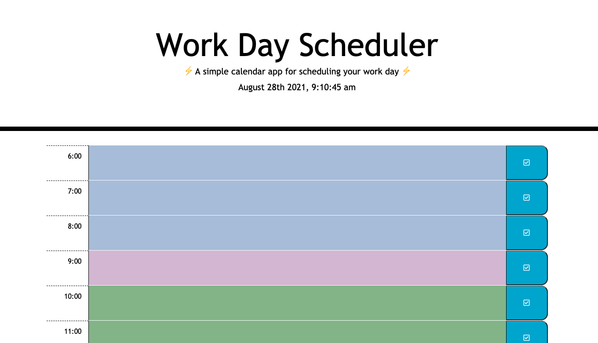

# Work Day Scheduler (Bootcamp Assignment 5 -  Third Party APIs)

By: Sadie Sial


## User Story

```
AS AN employee with a busy schedule
YOU WANT to add important events to a daily planner
SO THAT you can manage my time effectively
```

```
In this application the user....
```


## Screenshot




## Links

[Deployed App](https://sadielinks.github.io/work-day-scheduler/)

[GitHub Repository](https://github.com/sadielinks/work-day-scheduler)